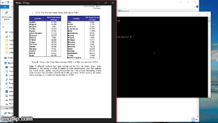

# Custom Table Detection with Mask RCNN 
Custom Table detection and automatic column finding tool using Mack RCNN model on tensorflow's object detection. Further we are using a custom ocr for the text reading function.

## Data Preparation

We have prepared the custom dataset for the training purpose of the algorithm. For it, we annotated 502 images using an opensource tool [labelimg](https://github.com/tzutalin/labelImg). Our dataset contained images from the axis bank dataset of tables. For training we have trained in two formats first whole tables(for automatic table detection in documents) and second for columns(To detect columns from detected tables).
The annotation should be in following format: 

```
<annotation>
    <folder>images</folder>
    <filename>image1.jpg</filename>
    <size>
        <width>1000</width>
        <height>563</height>
    </size>
    <segmented>0</segmented>
    <object>
        <name>Tie Fighter</name>
        <bndbox>
            <xmin>112</xmin>
            <ymin>281</ymin>
            <xmax>122</xmax>
            <ymax>291</ymax>
        </bndbox>
    </object>
    <object>
        <name>Tie Fighter</name>
        <bndbox>
            <xmin>87</xmin>
            <ymin>260</ymin>
            <xmax>95</xmax>
            <ymax>268</ymax>
        </bndbox>
    </object>
</annotation>
```

Please make sure they are exported as PASCAL VOC format.

You’ll need to add your training images to `images`, add your XML annotations to `annotations/xmls`, update `trainval.txt`, and `label_map.pbtxt`.

`trainval.txt` is a list of file names that allows us to find and correlate the `JPG` and `XML` files. The following `trainval.txt` list would let us to find `abc.jpg`, `abc.xml`, `123.jpg`, `123.xml`, `xyz.jpg` and `xyz.xml`

## Installation

First, with python and pip installed, install the scripts requirements:

```bash
pip install -r requirements.txt
```
Then you must compile the Protobuf libraries:

```bash
protoc object_detection/protos/*.proto --python_out=.
```

Add `models` and `models/slim` to your `PYTHONPATH`:

```bash
export PYTHONPATH=$PYTHONPATH:`pwd`:`pwd`/slim
```

>_**Note:** This must be ran every time you open terminal, or added to your `~/.bashrc` file._


## Usage
### 1) Create the TensorFlow Records
Run the script:

```bash
python object_detection/create_tf_record.py
```

Once the script finishes running, you will end up with a `train.record` and a `val.record` file. This is what we will use to train the model.

### 2) Download a Base Model
Training an object detector from scratch can take days, even when using multiple GPUs! In order to speed up training, we’ll take an object detector trained on a different dataset, and reuse some of it’s parameters to initialize our new model.

You can find models to download from this [model zoo](https://github.com/bourdakos1/Custom-Object-Detection/blob/master/object_detection/g3doc/detection_model_zoo.md). Each model varies in accuracy and speed. I used `faster_rcnn_resnet101_coco` for the demo.

Extract the files and move all the `model.ckpt` to our models directory.

>_**Note:** If you don't use `faster_rcnn_resnet101_coco`, replace `faster_rcnn_resnet101.config` with the corresponding [config file](https://github.com/bourdakos1/Custom-Object-Detection/tree/master/object_detection/samples/configs)._

### 3) Train the Model
Run the following script to train the model:

```bash
python object_detection/train.py \
        --logtostderr \
        --train_dir=train \
        --pipeline_config_path=faster_rcnn_resnet101.config
```

### 4) Export the Inference Graph

You can find checkpoints for your model in `Custom-Object-Detection/train`.

Move the model.ckpt files with the highest number to the root of the repo:
- `model.ckpt-STEP_NUMBER.data-00000-of-00001`
- `model.ckpt-STEP_NUMBER.index`
- `model.ckpt-STEP_NUMBER.meta`

In order to use the model, you first need to convert the checkpoint files (`model.ckpt-STEP_NUMBER.*`) into a frozen inference graph by running this command:

```bash
python object_detection/export_inference_graph.py \
        --input_type image_tensor \
        --pipeline_config_path faster_rcnn_resnet101.config \
        --trained_checkpoint_prefix model.ckpt-STEP_NUMBER \
        --output_directory output_inference_graph
```

You should see a new `output_inference_graph` directory with a `frozen_inference_graph.pb` file.

### 5) Test the Model
Just run the following command:

```bash
python object_detection/object_detection_runner.py
```

It will run your object detection model found at `output_inference_graph/frozen_inference_graph.pb` on all the images in the `test_images` directory and output the results in the `output/test_images` directory.

## Results
Here’s what I got from running my model over all the frames in this clip from table data provided by axis bank

.png)

.png)

.png)

.png)

.png)

.png)
